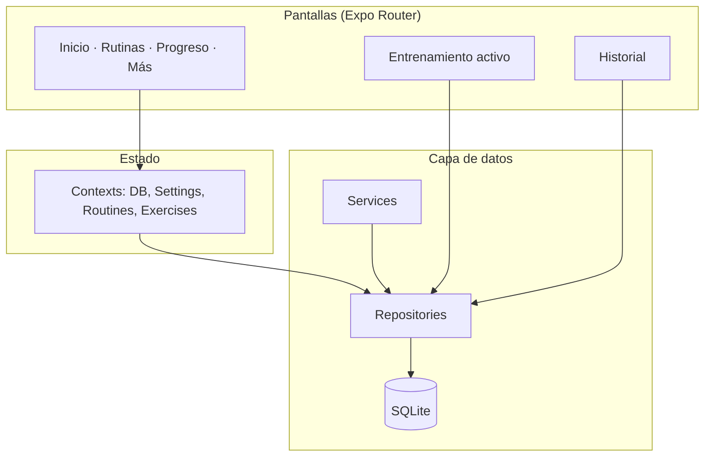

<p align="center">
  <strong style="font-size: 2rem">GYMI</strong>
  <br />
  <em>Tu entrenamiento personal, en el bolsillo.</em>
</p>

<p align="center">
  <a href="https://expo.dev"></a>
  <a href="https://reactnative.dev"></a>
  <a href="https://www.typescriptlang.org"></a>
  <a href="https://docs.expo.dev/versions/latest/sdk/sqlite/"></a>
</p>

<p align="center">
  App móvil offline para registrar entrenamientos, rutinas y progreso en el gimnasio.
  <br />
  Sin cuentas, sin internet, sin complicaciones.
</p>

---

## ¿Qué es GYMI?

**GYMI** es un rastreador de gimnasio pensado para el uso real: máquinas en kg o lb, rutinas por días, series al momento y estadísticas que importan. Todo se guarda **localmente** en tu dispositivo con SQLite, así que funciona aunque el gym no tenga señal.

| | |
|---|---|
| 📴 **Offline-first** | Datos en el teléfono, sin depender de la nube |
| 🏋️ **Entrenamiento activo** | Registra series, descanso y notas en pantalla completa |
| 📊 **Progreso visual** | Récords, volumen y gráficos por ejercicio |
| 💾 **Backup propio** | Exporta e importa JSON + fotos cuando quieras |
| ⚖️ **kg / lb por serie** | Cada máquina con su unidad, sin configuración global |

---

## Funcionalidades

### Inicio
- Dashboard con el **día de entrenamiento de hoy**
- Inicio rápido de sesión o retoma de entrenamiento activo
- Acceso directo para agregar ejercicios si el día está vacío

### Rutinas
- Crear y activar rutinas de entrenamiento
- Organizar **días** (Pecho, Pierna, etc.) con orden arrastrable
- Asignar ejercicios del catálogo a cada día
- Búsqueda por nombre, músculo o equipo al agregar ejercicios

### Catálogo de ejercicios
- CRUD completo de ejercicios
- Foto desde cámara o galería
- Notas, grupo muscular y equipamiento

### Entrenamiento activo
- Vista fullscreen por ejercicio
- Registro de **peso + repeticiones** por serie
- Selector **kg / lb por máquina** en cada serie
- Temporizador de descanso configurable
- Detección automática de **récords personales** (peso, reps, volumen)
- Notas por sesión, ejercicio y serie

### Progreso
- Récords personales destacados
- Estadísticas por ejercicio: último peso, máximo, volumen y sesiones
- Gráficos de evolución (peso, volumen, repeticiones)

### Historial
- Listado de sesiones completadas
- Detalle de cada entrenamiento con todas las series

### Más (configuración)
- Tema: oscuro, claro o sistema
- Temporizador de descanso por defecto (60 s – 3 min)
- Exportar / importar backup
- Borrado total de datos

---

## Flujo recomendado

```
1. Crear ejercicios en el catálogo
        ↓
2. Crear una rutina y marcarla como activa
        ↓
3. Añadir días (Lunes pierna, Miércoles pecho…)
        ↓
4. Asignar ejercicios a cada día
        ↓
5. Desde Inicio → Iniciar entrenamiento
        ↓
6. Registrar series (elige kg o lb según la máquina)
        ↓
7. Revisa progreso e historial cuando quieras
```

---

## Stack técnico

| Capa | Tecnología |
|------|------------|
| Framework | [Expo SDK 57](https://docs.expo.dev/versions/v57.0.0/) + [Expo Router](https://docs.expo.dev/router/introduction/) |
| UI | React Native 0.86, React 19 |
| Lenguaje | TypeScript 6 |
| Base de datos | [expo-sqlite](https://docs.expo.dev/versions/v57.0.0/sdk/sqlite/) |
| Gráficos | [react-native-gifted-charts](https://github.com/Abhinandan-Kushwaha/react-native-gifted-charts) |
| Gestos / listas | react-native-gesture-handler, react-native-draggable-flatlist |
| Paquetes | pnpm |

---

## Arquitectura



### Estructura del proyecto

```
app/                  Pantallas y navegación (file-based routing)
components/
  ui/                 Botones, inputs, cards, estados vacíos…
  workout/            SetLogger, RestTimer, WeightUnitToggle
contexts/             Providers de estado global
database/             Schema, migraciones y cliente SQLite
repositories/         Acceso a datos (CRUD)
services/             Lógica de negocio (peso, progreso, backup…)
types/                Entidades y tipos TypeScript
constants/            Tema, presets de descanso, grupos musculares
hooks/                useThemeColors, re-exports de contexts
utils/                Fechas, validación
```

### Modelo de peso

- Almacenamiento interno siempre en **gramos** (comparaciones y PRs consistentes)
- Cada serie guarda su **unidad original** (`kg` o `lb`)
- Historial y entrenamiento muestran la unidad con la que se registró
- Progreso infiere la unidad desde las series del ejercicio

---

## Requisitos

- [Node.js](https://nodejs.org/) 18+
- [pnpm](https://pnpm.io/) (`npm install -g pnpm`)
- [Expo Go](https://expo.dev/go) en Android/iOS **o** emulador

---

## Instalación y desarrollo

```bash
# Clonar el repositorio
git clone https://github.com/david-cascante/GYMI.git
cd GYMI

# Instalar dependencias
pnpm install

# Iniciar Metro (limpiar caché si hace falta)
pnpm start --clear
```

Escanea el QR con **Expo Go** (misma red WiFi) o usa:

```bash
pnpm android   # Android emulador / dispositivo
pnpm ios       # iOS (macOS)
pnpm web       # Navegador
pnpm typecheck # Verificación TypeScript
```

### USB (Android)

```bash
adb devices
adb reverse tcp:8081 tcp:8081
pnpm android
```

### Problemas comunes

| Problema | Solución |
|----------|----------|
| Pantalla blanca al abrir | Borra datos de Expo Go y reinicia con `pnpm start --clear` |
| Base de datos corrupta | Más → Eliminar todos los datos, o borrar datos de la app |
| Tunnel / QR falla | Usa la misma WiFi o USB con `adb reverse` |

---

## Backup

GYMI exporta un archivo JSON con rutinas, ejercicios, sesiones, series, configuración y fotos (Base64). Puedes guardarlo donde quieras e importarlo en otro dispositivo desde **Más → Importar datos**.

---

## Roadmap (ideas)

- [ ] Notificaciones de descanso en segundo plano
- [ ] Widget de entrenamiento activo
- [ ] APK/IPA standalone con EAS Build
- [ ] Sincronización opcional en la nube

---

## Licencia

Proyecto privado. © [david-cascante](https://github.com/david-cascante).

---

<p align="center">
  Hecho con 💪 para entrenar sin fricción.
</p>
